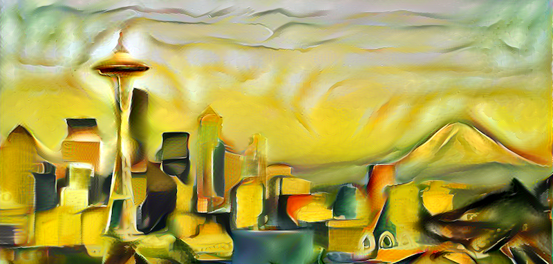
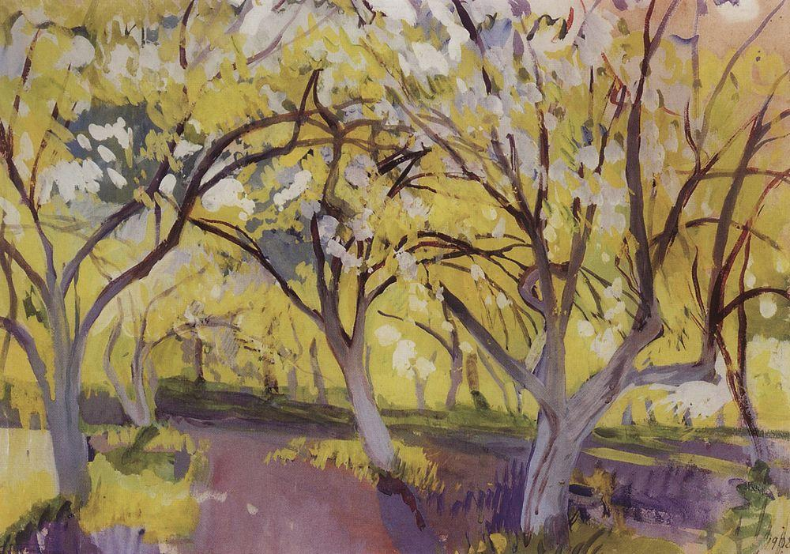
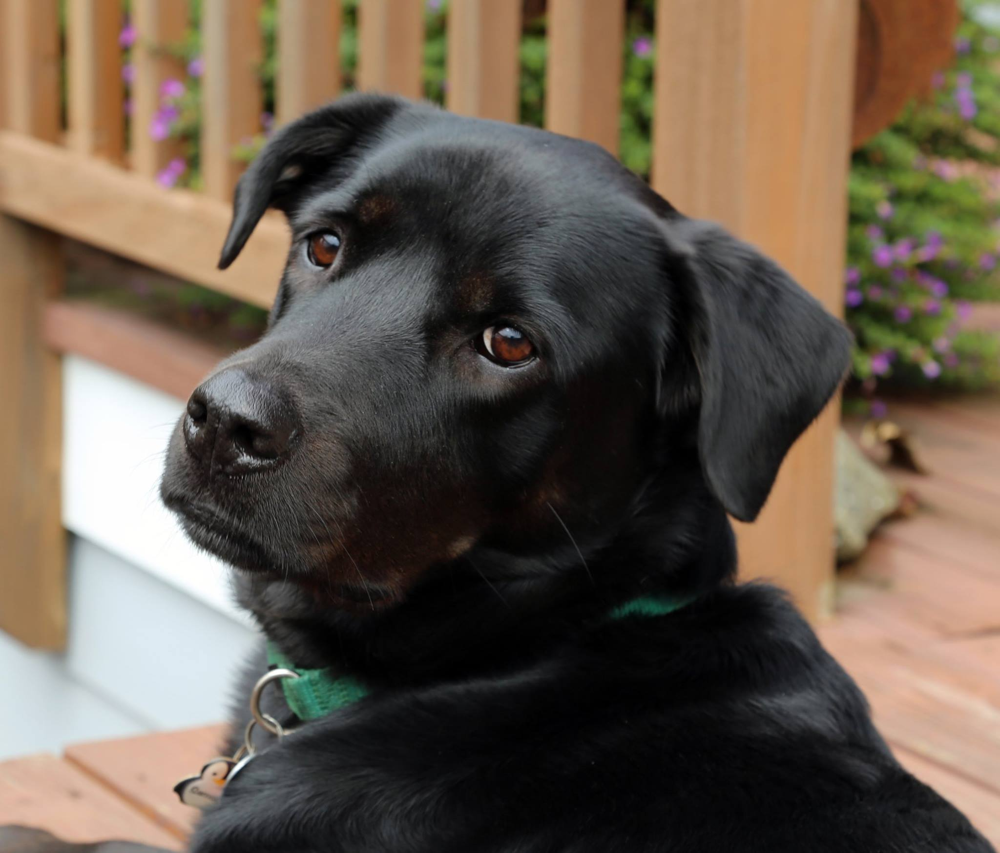
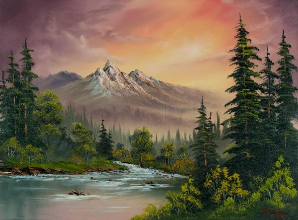
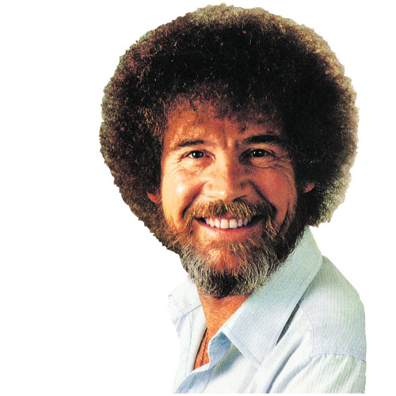
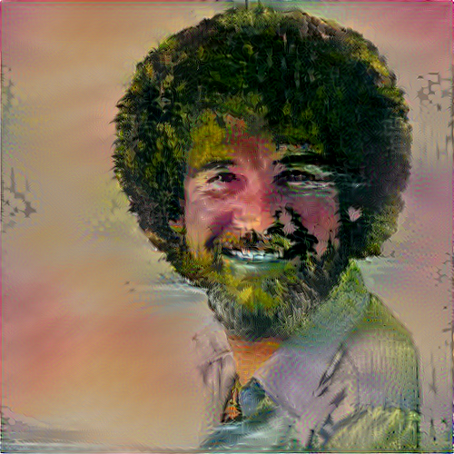

### Style Transfer with Tensorflow

First and foremost, you should know that I did *not* write the code to perform the style transfer myself. I am implementing some terrific work found here https://github.com/cysmith/neural-style-tf to use tensorflow to transfer photographs into they style of some artists that I enjoy.

Here I've transfered a picture of my dog, Samson, into the style of "Orchard in Bloom" by Zinaida Serebriakova.

The next example was lot of fun. I decided to Bob Rossify Bob Ross.

